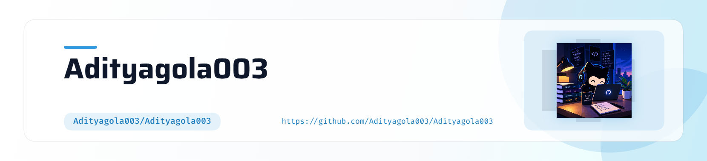

<!-- ========================= HEADER ========================= -->

<picture>
  <source
    media="(prefers-color-scheme: dark)"
    srcset="./art/header-dark.png"
  />
  
</picture>

  

<h1>Hey there, I'm Aditya Gola</h1>

  

 

<!-- ========================= ABOUT ME ========================= -->

<h2 align="center">👨‍💻 About Me</h2>

<table align="center">
<tr>

<td width="65%" valign="top">

I'm <strong>Aditya Gola</strong>, a Computer Science Engineering student passionate about
<strong>Artificial Intelligence, software development, and building practical technology solutions.</strong>

I enjoy creating AI-powered applications, developing full-stack products,
solving challenging problems, and exploring how intelligent systems can be
integrated into real-world software.

🎓 <strong>Education:</strong> B.Tech CSE — ABES Engineering College 
🤖 <strong>Focus:</strong> AI, Software Development & DSA 
🧠 <strong>Interests:</strong> Artificial Intelligence, Machine Learning & Full Stack Development 
🔭 <strong>Currently Building:</strong> OmniVision 
📚 <strong>Currently Learning:</strong> AI/ML, Backend Development, DSA & System Design 
🎯 <strong>Goal:</strong> Build intelligent software products that solve real-world problems 
🌐 <strong>Location:</strong> India

💡 I believe in learning by building, writing clean code, and continuously
improving my technical and problem-solving skills.

</td>

<td width="35%" align="center" valign="middle">

  

<strong>💻 Building. Learning. Improving.</strong>

</td>

</tr>
</table>

 

<!-- ========================= TECH STACK ========================= -->

<h2 align="center">Tech Stack</h2>

<table>
<tr>
<td align="center">

</td>
</tr>
</table>

 

<strong>Languages · Web Development · AI/ML · Backend · Databases · Tools</strong>

 

<!-- ========================= GITHUB STREAK ========================= -->

<h2 align="center">GitHub Streak</h2>

 

<!-- ========================= CONTRIBUTION SNAKE ========================= -->

<h2 align="center">🐍 Contribution Graph</h2>

  

 

<!-- ========================= FEATURED PROJECTS ========================= -->

<h2 align="center">Featured Projects</h2>

<table align="center">
<tr>

<td width="50%" align="center" valign="top">

<h3>OmniVision</h3>

An AI-powered image assistant focused on image analysis,
organization, enhancement, and intelligent content processing.

</td>

<td width="50%" align="center" valign="top">

<h3>Carbon Footprint Calculator</h3>

A full-stack application that calculates and visualizes
carbon emissions using an empirical approach.

</td>

</tr>
</table>

 

<!-- ========================= CONNECT ========================= -->

<h2 align="center">Let's Connect</h2>

  

<!-- ========================= FOOTER ========================= -->

 

Built by Aditya Gola

